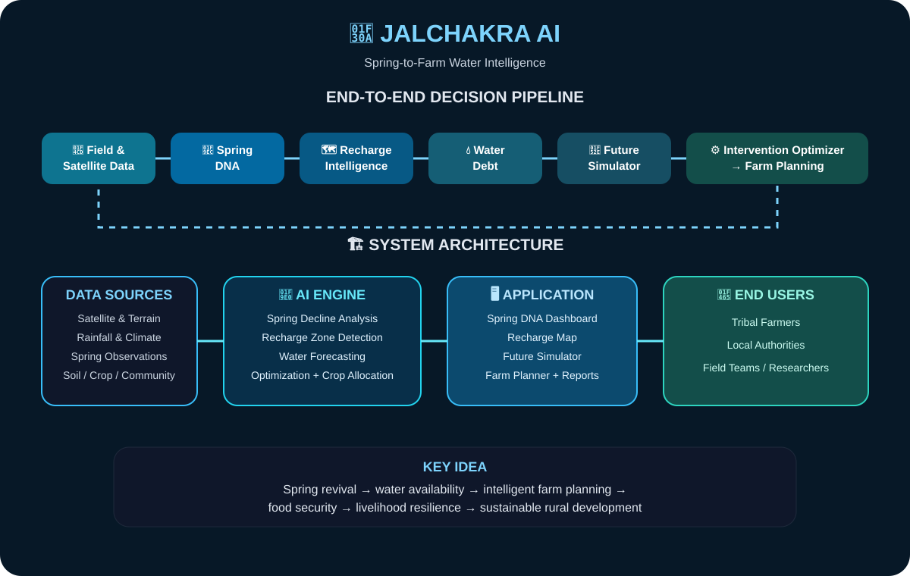
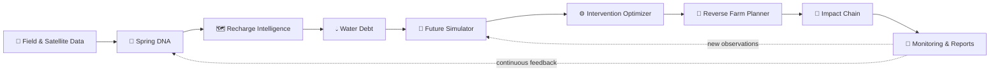
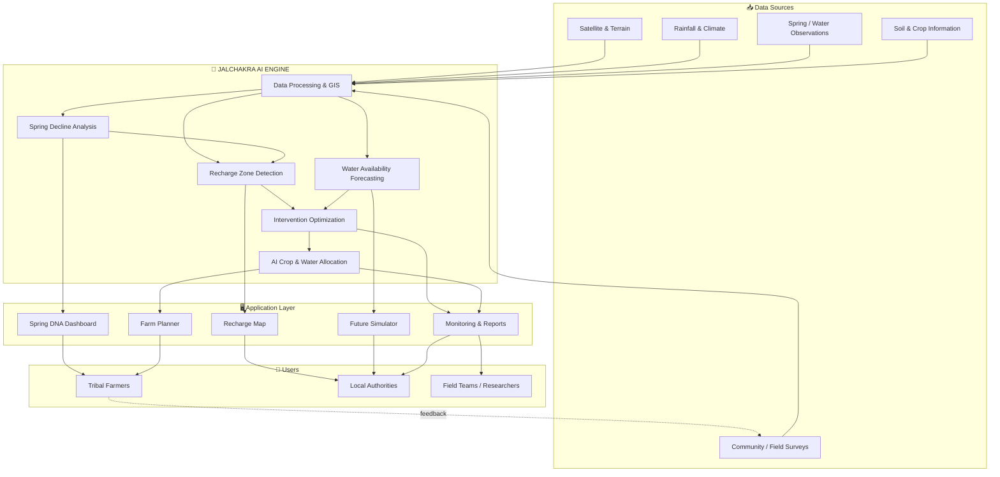

# 🌊 JALCHAKRA AI

### **AI-Based Spring Revival & Recharge Planning for Tribal Areas**

<p align="center">
  <b>Spring → Recharge → Water Security → Farm Planning → Impact</b>
</p>

<p align="center">
  
  
  
  
</p>

<p align="center">
  
</p>

---

## 💧 What is JALCHAKRA AI?

JALCHAKRA AI is a **software-first water intelligence and planning platform** for spring revival and recharge planning in tribal and rural regions. Instead of treating a spring as an isolated water source, the platform connects the complete planning chain:

**Spring health → recharge zone → water debt → interventions → future scenarios → farm planning → measurable impact**

The prototype is designed for a hackathon setting: it demonstrates the complete decision workflow while keeping live field/IoT integrations and production geospatial datasets as future extensions.

## ✨ Core Innovation

| Module | What it does |
|---|---|
| 🧬 **Spring DNA** | Creates a structured health profile for each spring from observations and indicators. |
| 🗺️ **Recharge Map** | Prioritizes recharge/intervention zones using location-aware planning signals. |
| 💧 **Water Debt** | Compares seasonal demand and available supply to expose water stress. |
| 🌾 **Reverse Farm Planner** | Starts with farm needs and works backward to water availability and feasible crop choices. |
| 🔮 **Future Simulator** | Stress-tests revival scenarios across different rainfall, budget and time assumptions. |
| ⚙️ **Intervention Optimizer** | Ranks intervention strategies against planning constraints. |
| 🔗 **Impact Chain** | Shows how interventions can flow from spring recovery to farm resilience. |
| 📡 **Monitoring** | Tracks observations, discharge/rainfall signals and validation feedback. |
| 📊 **Reports** | Builds a decision-ready planning summary for field and review teams. |

## 🎨 Project Visual Overview

<p align="center">
  
</p>

> **Visual:** Spring revival → recharge intelligence → AI planning → farm decisions → impact.


## ✨ Feature Highlights

<table>
<tr>
<td width="50%">

### 🧬 Spring DNA
Build a structured health profile from spring observations and key indicators.

</td>
<td width="50%">

### 🗺️ Recharge Intelligence
Turn location, terrain and planning signals into prioritized recharge opportunities.

</td>
</tr>
<tr>
<td width="50%">

### 🔮 Future Simulator
Compare possible revival scenarios before committing resources in the field.

</td>
<td width="50%">

### 🌾 Reverse Farm Planner
Start from crop and farm needs, then work backward from realistic water availability.

</td>
</tr>
<tr>
<td width="50%">

### ⚙️ Intervention Optimizer
Evaluate intervention combinations against water, budget and planning constraints.

</td>
<td width="50%">

### 📊 Impact & Reports
Connect water recovery to farm resilience and generate decision-ready summaries.

</td>
</tr>
</table>

## 🎬 Product Walkthrough

**The demo follows one decision journey:**

`Spring Health → Recharge → Water Stress → Scenario → Intervention → Farm Plan → Impact`

| Stage | User sees | Decision supported |
|---|---|---|
| 🧬 Spring DNA | Spring health profile | What is changing? |
| 🗺️ Recharge Map | Priority zones | Where should action happen? |
| 💧 Water Debt | Supply vs demand | How large is the gap? |
| 🔮 Simulator | Future scenarios | What could happen next? |
| ⚙️ Optimizer | Intervention options | What should be prioritized? |
| 🌾 Farm Planner | Crop/water plan | How can recovered water be used? |
| 🔗 Impact Chain | Outcome pathway | What impact can be tracked? |
| 📊 Reports | Planning summary | What can the team act on? |

> **Presentation tip:** Start with the spring, follow the water, and finish with the farm decision. This keeps the hackathon demo focused on one continuous story.

## 📌 Prototype Status

| Area | Status |
|---|---|
| Core planning workflow | 🟢 Prototype ready |
| Dashboard & visualizations | 🟢 Implemented |
| Recharge / water-planning modules | 🟢 Implemented foundation |
| Scenario & optimization workflow | 🟢 Implemented foundation |
| Live field / IoT ingestion | 🟡 Roadmap |
| Production geospatial datasets | 🟡 Roadmap |
| Field-calibrated AI models | 🟡 Roadmap |

## 🧠 End-to-End System Flow

### 🌊 Spring-to-Farm Decision Pipeline



### 🏗️ System Architecture



> **Core idea:** JALCHAKRA AI connects spring revival with downstream farm planning, so water recovery becomes a measurable livelihood decision.

## 🏆 Why this is different

Most water dashboards stop at **measurement and visualization**. JALCHAKRA AI is structured as a **decision loop**:

1. Identify the spring's current health.
2. Locate and rank recharge opportunities.
3. Quantify water stress as a demand-vs-supply gap.
4. Test intervention scenarios before field deployment.
5. Optimize the intervention package.
6. Convert expected water availability into farm decisions.
7. Track impact and feed observations back into the planning cycle.

> **Don't only measure water. Understand its journey.**

## 🎯 SIH 2026 Alignment

- **Organization:** Ministry of Tribal Affairs
- **Problem ID:** **SIH26240**
- **Problem:** AI-Based Spring Revival and Recharge Planning for Tribal Areas
- **Category:** Software
- **Theme:** Agriculture, FoodTech & Rural Development

## 🖥️ Demo Journey

For a hackathon presentation, the recommended click-through is:

```text
Landing Page
   ↓
Dashboard / Spring DNA
   ↓
Recharge Map
   ↓
Water Debt
   ↓
Future Simulator
   ↓
Intervention Optimizer
   ↓
Reverse Farm Planner
   ↓
Impact Chain
   ↓
Monitoring
   ↓
Reports
```

This tells one continuous story instead of presenting the modules as disconnected pages.

## 🛠️ Tech Stack

- **Frontend:** Next.js, React, TypeScript
- **UI:** Tailwind CSS, Framer Motion, Lucide React
- **Maps:** Leaflet / React Leaflet
- **Charts:** Recharts
- **Data layer:** Drizzle ORM
- **Local development:** PGlite-compatible setup
- **Database architecture:** PostgreSQL-compatible

## 🚀 Run Locally

### 1. Clone the repository

```bash
git clone https://github.com/sakshi01-art/jalchakra_ai.git
cd jalchakra_ai
```

### 2. Install dependencies

```bash
npm install
```

### 3. Configure environment

Copy `.env.example` to your local environment file and replace placeholder values with your own local configuration.

```bash
# Windows PowerShell
Copy-Item .env.example .env.local

# macOS / Linux
cp .env.example .env.local
```

### 4. Start development server

```bash
npm run dev
```

Open the local URL printed by Next.js.

> **Prototype note:** Demo data and simulated projections are intended for hackathon demonstration. Live field/IoT ingestion, production geospatial layers and model calibration are roadmap items.

## 📁 Project Structure

```text
src/
├── app/
│   ├── (app)/
│   │   ├── farm-planner/
│   │   ├── recharge-map/
│   │   ├── water-debt/
│   │   ├── simulator/
│   │   ├── optimizer/
│   │   ├── impact-chain/
│   │   ├── monitoring/
│   │   ├── reports/
│   │   └── settings/
│   ├── dashboard/
│   ├── spring-dna/
│   └── api/
├── components/
├── db/
└── lib/
```

## 🔌 API Surface

The application includes route handlers for the main planning workflow, including:

- `/api/springs` — spring discovery/selection
- `/api/health` — health signals
- `/api/observations` — field observations
- `/api/recharge-map` — recharge planning data
- `/api/water-debt` — demand/supply stress
- `/api/simulate` — scenario projections
- `/api/optimize` — intervention optimization
- `/api/farm-planner` — farm planning calculations
- `/api/dashboard` — dashboard data

## 🔐 Security & Configuration

Secrets and local environment files are intentionally excluded from version control. Use `.env.example` as the safe configuration template. Never commit `.env.local`, API keys, database credentials or other private secrets.

## 🌱 Roadmap

- [x] Spring health dashboard
- [x] Spring DNA profiles
- [x] Recharge map foundation
- [x] Water debt module
- [x] Scenario simulation foundation
- [x] Intervention optimization foundation
- [x] Reverse farm planning workflow
- [x] Impact-chain visualization
- [x] Monitoring workflow
- [x] Decision-ready report builder
- [ ] Connect to live field/IoT observations
- [ ] Add production-grade geospatial datasets
- [ ] Calibrate models with field observations
- [ ] Add district-level deployment and role-based access

---

<p align="center">
  <b>🌊 JALCHAKRA AI</b><br/>
  <sub>Building a smarter bridge from spring revival to farm resilience.</sub>
</p>


---

## 🔥 Latest Update — 20 September 2026

- Refined the **Spring-to-Farm** product story.
- Kept the core planning modules clearly organized for the SIH 2026 demo.
- Clarified the separation between prototype features and future live-data integrations.


## 🔥 Latest Update — 22 September 2026

- Added documentation for the Spring-to-Farm decision model.
- Clarified how spring health, recharge, water availability, intervention scenarios, and farm planning connect.
- Kept live field/IoT data and field-calibrated models clearly marked as future extensions.

## 🚀 Development Update — 22 September 2026

- Refined the end-to-end **Spring → Recharge → Water → Farm** decision narrative.
- Kept prototype intelligence clearly separated from future field-calibrated data.
- Aligned the dashboard modules around one continuous planning workflow.

---

## 🚀 Development Update — 24 September 2026

- Refined the **Spring → Recharge → Water → Farm** planning workflow.
- Added clearer checkpoints for scenario comparison, intervention planning, and decision-ready outputs.
- Kept live field data, IoT integration, and field-calibrated models explicitly separated as future work.

---

## ✨ Development Update — 26 September 2026

- Refreshed the project documentation for the latest development stage.
- Kept the roadmap focused on practical implementation, testing, and continuous improvement.
- Updated the project progress section so the repository stays current and easy to review.
