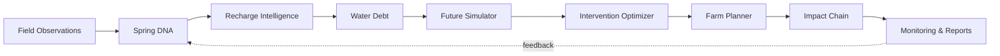

# 🌊 JALCHAKRA AI

### **AI-Based Spring Revival & Recharge Planning for Tribal Areas**

<p align="center">
  <b>Spring → Recharge → Water Security → Farm Planning → Impact</b>
</p>

<p align="center">
  
  
  
  
</p>

<p align="center">
  
</p>

---

## 💧 What is JALCHAKRA AI?

JALCHAKRA AI is a software platform designed for **spring revival and recharge planning** in tribal and rural regions. Instead of treating a spring as an isolated water source, the platform connects the complete chain:

**Spring health → recharge zone → water debt → interventions → future scenarios → farm planning → measurable impact**

The goal is to help field teams and decision-makers move from scattered observations to **evidence-based, location-aware water planning**.

## ✨ Core Innovation

| Module | What it does |
|---|---|
| 🧬 **Spring DNA** | Builds a structured health profile for each spring using observations and indicators. |
| 🗺️ **Recharge Map** | Visualizes springs and recharge/intervention planning areas on an interactive map. |
| 💧 **Water Debt** | Compares demand and available water to expose seasonal stress. |
| 🌾 **Reverse Farm Planner** | Starts with farm needs and works backward to water availability and feasible crops. |
| 🔮 **Future Simulator** | Compares possible future outcomes under different intervention scenarios. |
| ⚙️ **Intervention Optimizer** | Ranks intervention strategies using available spring and recharge information. |
| 🔗 **Impact Chain** | Connects interventions with spring recovery, water security and farm outcomes. |
| 📊 **Monitoring & Reports** | Supports observation tracking and decision-ready reporting. |

## 🧠 System Flow



## 🎯 SIH 2026 Alignment

- **Organization:** Ministry of Tribal Affairs
- **Problem ID:** **SIH26240**
- **Problem:** AI-Based Spring Revival and Recharge Planning for Tribal Areas
- **Category:** Software
- **Theme:** Agriculture, FoodTech & Rural Development

## 🛠️ Tech Stack

- **Frontend:** Next.js, React, TypeScript
- **UI:** Tailwind CSS, Framer Motion, Lucide React
- **Maps:** Leaflet / React Leaflet
- **Charts:** Recharts
- **Data layer:** Drizzle ORM
- **Local development:** PGlite-compatible setup
- **Database:** PostgreSQL-compatible architecture

## 🚀 Run Locally

```bash
npm install
npm run dev
```

Then open the local development URL shown by Next.js.

For environment configuration, copy `.env.example` to your local environment file and set your own values.

## 📁 Project Structure

```text
src/
├── app/
│   ├── (app)/
│   │   ├── farm-planner/
│   │   ├── recharge-map/
│   │   ├── water-debt/
│   │   ├── simulator/
│   │   ├── optimizer/
│   │   ├── impact-chain/
│   │   ├── reports/
│   │   └── settings/
│   ├── dashboard/
│   ├── spring-dna/
│   └── api/
├── components/
├── db/
└── lib/
```

## 🌱 Design Philosophy

> **Don't only measure water. Understand its journey.**

JALCHAKRA AI is built around a closed-loop planning approach: observations inform models, models support interventions, interventions affect water availability, and new observations can feed the next planning cycle.

## 🔐 Security & Configuration

Secrets and local environment files are intentionally excluded from version control. Use `.env.example` as the safe configuration template.

## 🗺️ Roadmap

- [x] Spring health dashboard
- [x] Recharge map foundation
- [x] Water debt module
- [x] Scenario simulation foundation
- [x] Intervention optimization foundation
- [x] Farm planning workflow
- [x] Impact-chain visualization
- [ ] Connect to live field/IoT observations
- [ ] Add production-grade geospatial datasets
- [ ] Calibrate models with field observations
- [ ] Deploy district-level monitoring

---

<p align="center">
  <b>🌊 JALCHAKRA AI</b><br/>
  <sub>Building a smarter bridge from spring revival to farm resilience.</sub>
</p>
