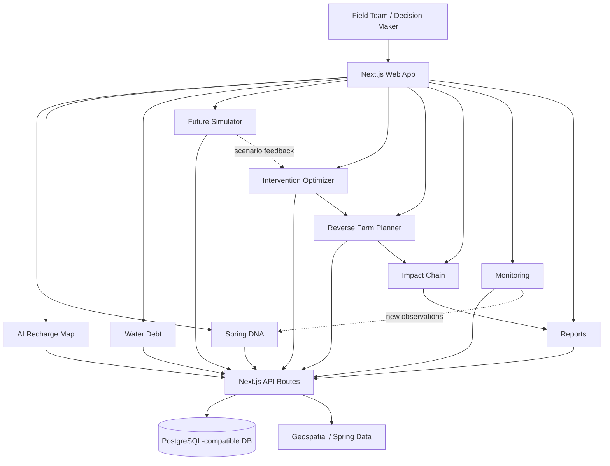

# 🌊 JALCHAKRA AI — Architecture & Demo Flow

## 1. Problem

**SIH 2026 · SIH26240**  
AI-Based Spring Revival and Recharge Planning for Tribal Areas

JALCHAKRA AI turns fragmented spring observations into a connected planning loop: **Spring Health → Recharge → Water Balance → Future Scenarios → Intervention → Farm Planning → Impact → Monitoring**.

## 2. High-Level Architecture

## 3. Intelligence Pipeline

### Step 1 — Observe
Capture spring discharge, rainfall, seasonal signals and community observations.

### Step 2 — Diagnose
Spring DNA converts observations into a structured spring-health profile.

### Step 3 — Locate
Recharge Map identifies priority areas and intervention suitability.

### Step 4 — Quantify
Water Debt estimates the demand–supply gap and highlights stressed springs.

### Step 5 — Simulate
Future Simulator tests intervention, rainfall and budget assumptions before field deployment.

### Step 6 — Optimize
The optimizer ranks intervention strategies instead of presenting only raw data.

### Step 7 — Plan farms
Reverse Farm Planner starts from farm needs and works backward to feasible water/crop decisions.

### Step 8 — Measure impact
Impact Chain connects interventions to spring recovery, water security and farm resilience.

### Step 9 — Close the loop
Monitoring and reports feed observations back into the next planning cycle.

## 4. Recommended SIH Demo Flow

**01. Dashboard** → establish the district/spring context.

**02. Spring DNA** → select one spring and show its health signal.

**03. Recharge Map** → show where recharge action should happen.

**04. Water Debt** → demonstrate the demand–supply gap.

**05. Simulator** → change rainfall/budget/scenario and run a projection.

**06. Optimizer** → compare intervention priorities.

**07. Farm Planner** → translate water availability into farm planning.

**08. Impact Chain** → show the complete cause-and-effect pathway.

**09. Monitoring** → show how new field observations validate the plan.

**10. Reports** → generate the decision-ready output for field teams.

## 5. Key Differentiator

The platform is not only a spring dashboard. Its differentiator is the **closed-loop decision system** that connects hydrological signals with intervention selection and downstream farm planning, while keeping simulated outputs visibly separated from field-validated observations.

## 6. Trust & Transparency

- Simulation outputs are marked as **SIMULATED**.
- Model assumptions are exposed through scenario controls.
- Field observations remain the validation layer.
- Recommendations are presented as planning signals, not guaranteed outcomes.
